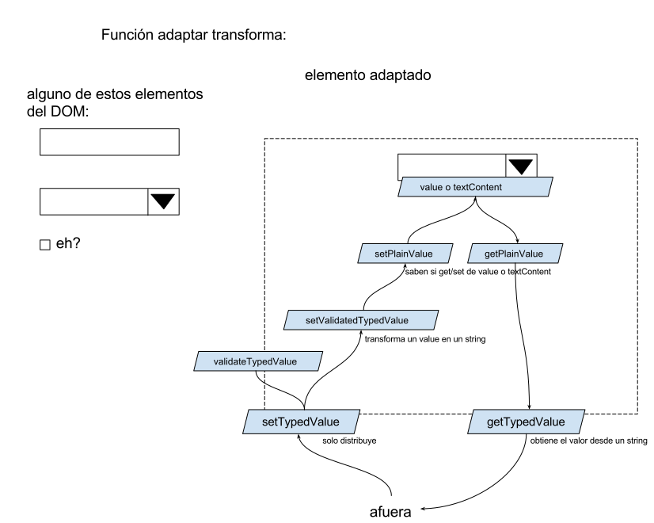

# estudio prelminar

## pantalla de edición

En el DOM se ponen los elementos que permiten **editar** los datos. Los datos están en otro lado 
(no residen en los "values" de los elementos del DOM)

### a largo plazo

A largo plazo estas características son deseables. Llamamos **almacén** al lugar donde residen los datos. 

característica      | descripción
--------------------|--------------
ida y vuelta        | si se interactúa con un elemento modificando el dato (value, checked, textContent o lo que sea) se modifica el almacén. A su vez si se modifica el almacén se refleja el valor en los elementos del DOM
vistas simultáneas  | podría ocurrir que haya varios elementos del DOM asociados al mismo registro y/o campo del almacén.
elementos complejos | para visualizar un valor podría ser necesario más de un elemento del DOM (por ejemplo timestamp with timezone se podría mostrar en varios). Esto podría traer un problema con el blur (porque el blur debe considerarse al salir del conjunto de elementos)
texto vacío vs null | debería poder diferenciar entre un valor null de un texto o una cadena vacía
lógico por teclado  | es deseable que el cursor pueda caer en un elemento de tipo lógico sí/no y que se pueda usar con el teclado (para un data entry)
fechas por teclado  | es deseable que las fechas se puedan escribir como si fueran textos
feedback por campo  | de algún modo tiene que haber una manera extendida de ver en texto completo cuál es el problema que hay cuando no se puede grabar un dato (ej: la fecha no es válida, o el almacén falla al recibir datos)
registros           | debe existir el concepto de registro completo y de "salir de un registro"
consistencias       | debe informar cuando se le guardan datos inconsistentes
saltos              | debe saltear los campos que no deberían poder ingresarse
tablas              | debe poder mostrar más de un registro a la vez
flechas             | debe poder mover el cursor entre campos y entre registros usando las flechas
crear registro      | debe permitir crear registros
eliminar registro   | debe poder eliminar un registro
maestro detalle     | debe permitir el esquema de maestro detalle
opciones a la vista | debe mostrar las opciones (para los conjuntos cerrados de opciones)

## implementación

### adapter

Los elementos (del DOM) van a tener un adaptador que sabe hacer get y set. 
Las funciones públicas de un elemento adaptado son: `setTypedValue` y `getTypedValue`. La implementación de esas funciones incluye:

función                  | pub. | fijo | uso
-------------------------|------|------|-----------------
`setTypedValue`          | púb  | fijo | manda a validar y luego a establecer el valor del elemento
`validateTypedData`      | priv | var  | determina si el valor pasado como parámetro es válido para el tipo (no se trata del texto ingresado sino del valor interno del programa)
`setValidatedTypedValue` | priv | var  | establece el valor del elemento de modo de estar listo para mostrarse bonito y útil
`setPlainValue`          | priv | fijo | para los elementos que se forman con un único valor de string (ej: `INPUT[type=text]` o `DIV`) asigna el valor que ya fue pasado a texto al atributo correspondiente (ej: `value` o `textContent`)
`getTypedValue`          | pub  | var  | obtiene el valor tipado del elemento a partir de su contenido interno
`getPlainValue`          | priv | fijo | obtiene el valor de texto del elemento (cuando tiene un único valor interno ej: `INPUT[type=text]` o `DIV`) basado en el atributo correspondiente (ej: `value` o `textContent`)

**Notas:** 
  * púb: función pública, que se usa desde fuera del elemento del DOM. O sea es su interface con el mundo exterior al elemento
  * fijo: función que siempre es igual
  * dep: función que su implementación depende del tipo (son las que hay que programar o revisar en cada tipo)

